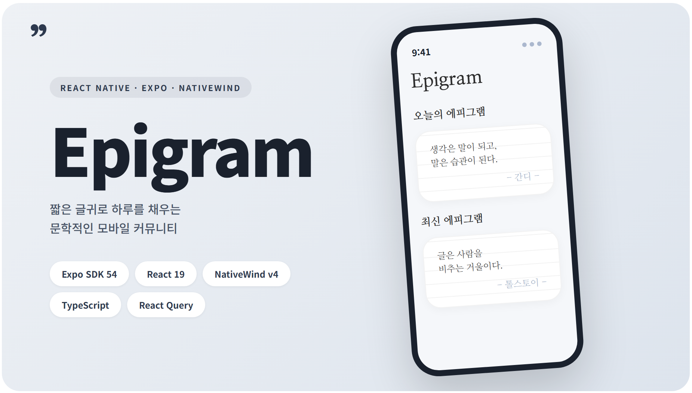
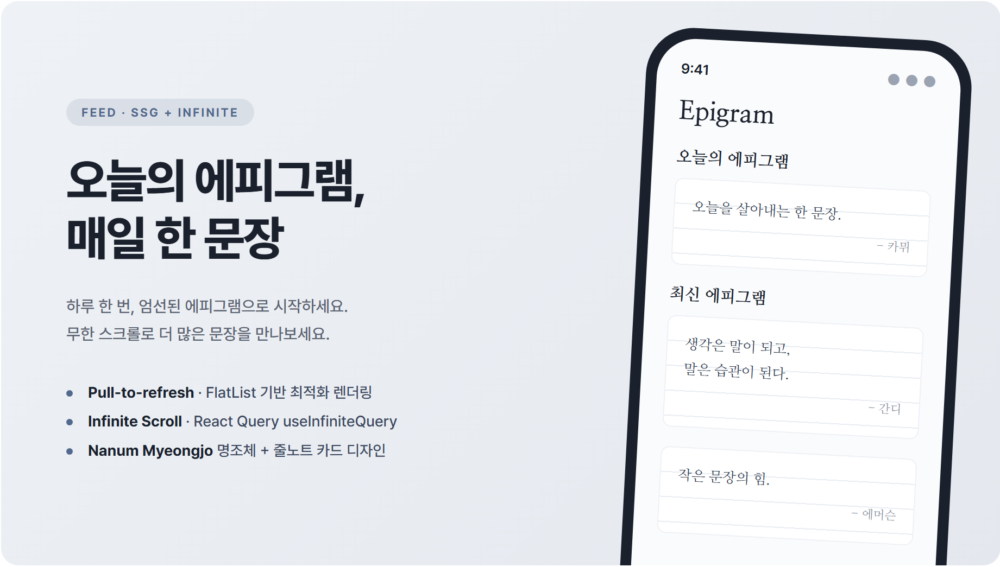
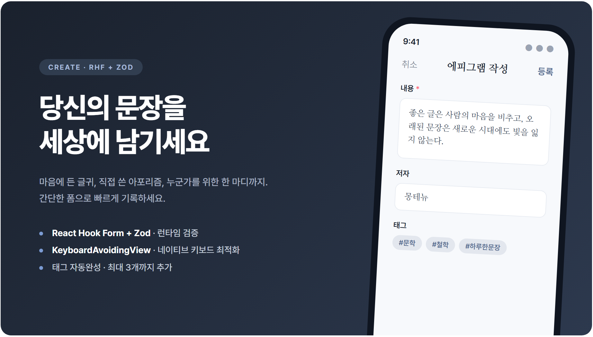
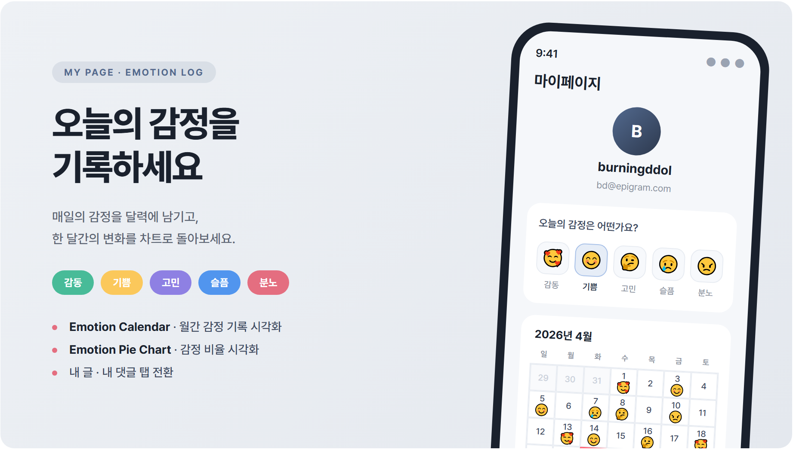

 

 
 

# 📖 Epigram Mobile

     

 

**📖 짧은 글귀로 하루를 채우는 문학적인 모바일 커뮤니티, Epigram**

‘Epigram Mobile’은 [Next.js 기반 웹 버전 Epigram](https://github.com/burningddol/epigram)의 디자인 시스템과 API 레이어를 그대로 계승한 iOS · Android 네이티브 앱입니다.

 

 

## 📱 직접 체험해보기

별도 빌드·설치 없이 **Expo Go 앱**만으로 실기기에서 바로 실행해볼 수 있어요.

1. App Store · Play Store 에서 **Expo Go** 설치
2. 아래 QR을 Expo Go 로 스캔 (또는 모바일에서 링크 탭)

> 딥링크: `exp://u.expo.dev/7c9f7aa6-075b-44b2-bc1b-f93e44a47414?channel-name=preview`
>
> EAS Update 기반이라 서버·로컬 머신 없이 24/7 접속 가능합니다.

 

 

오늘의 에피그램과 최신 글을 무한 스크롤로 만날 수 있어요.

 

 

여러분의 문장을 세상에 남겨보세요.

내용 · 저자 · 출처에 태그까지 붙여 간편하게 작성할 수 있도록 설계했어요.

 

 

매일의 감정을 달력에 기록하고, 한 달간의 변화를 차트로 돌아볼 수 있어요.

5가지 감정(감동 · 기쁨 · 고민 · 슬픔 · 분노)을 각각의 색상으로 구분해 감정 비율을 한눈에 시각화합니다.

 

 

## 😎 Development Description

- 기존 **[Next.js 웹 프로젝트](https://github.com/burningddol/epigram)를 React Native로 포팅**하며, 웹의 API 스키마·도메인 타입·컴포넌트 인터페이스를 재사용해 기능 개발 속도를 확보했어요.
- **Claude-design 기반 디자인 추출 워크플로우**로 기존 웹프로젝트의 컬러 토큰·타이포그래피·컴포넌트 스펙을 분석하고, 이를 NativeWind v4 디자인 시스템으로 **1:1 포팅**했어요.
- TanStack Query `useInfiniteQuery`로 피드 무한 스크롤과 캐싱을 관리해 서버 상태 일관성을 확보했어요.
- React Hook Form + Zod 스키마 기반 **런타임 검증**으로 타입 안전한 폼을 작성했어요.
- ErrorBoundary와 선언적 에러 처리 패턴으로 렌더링 에러를 일관되게 관리해요.
- Zustand를 이용해 클라이언트 상태를 관리하고, 서버 상태와 명확히 분리했어요.

 

 

## 🧑🏻‍💻 Developer

| 개발자      | GITHUB                         |
| ----------- | ------------------------------ |
| burningddol | https://github.com/burningddol |
